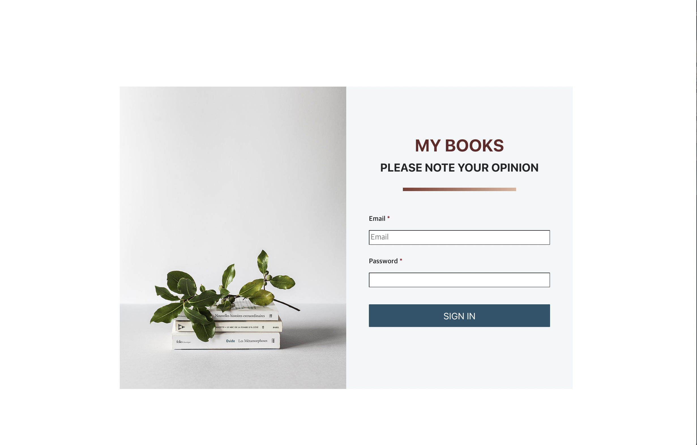
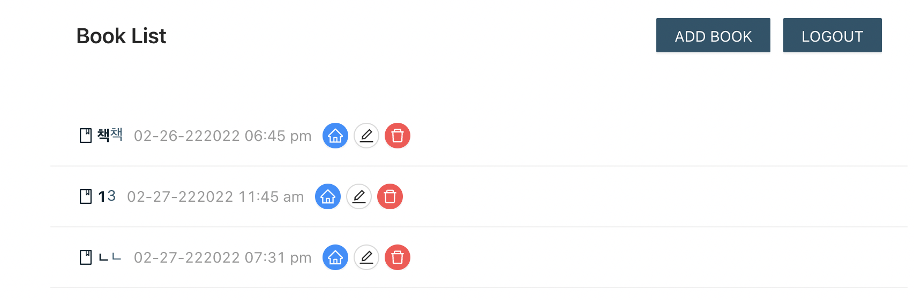
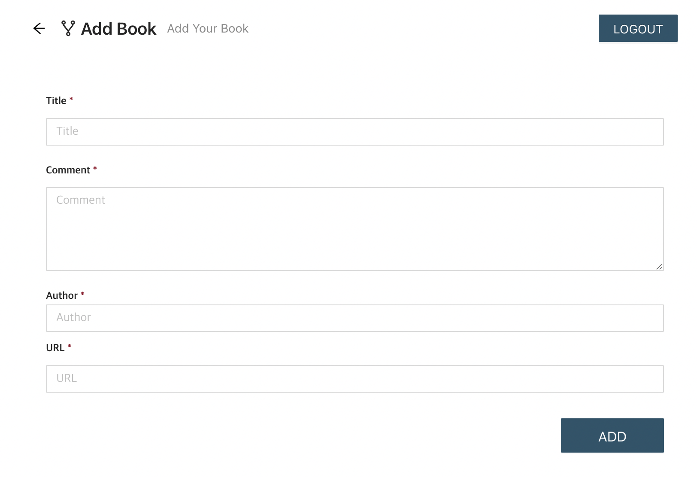

# MyBookSite

- 앱 설명
  - 내가 읽은 책을 저장하고 기록을 남길 수 있는 온라인 책장 개발
- 사용 Skills
  - TypeScript, React, Redux
- 기능 구현
  - 로그인 API 연동
  - 내가 읽은 책 추가, 삭제할 수 있는 기능 구현
- 성장한 부분
  - TypeScript, React, Redux에 대한 기본적인 기능 학습

< 로그인 UI >

< 추가된 책 리스트 UI >

< 책 추가 UI >

